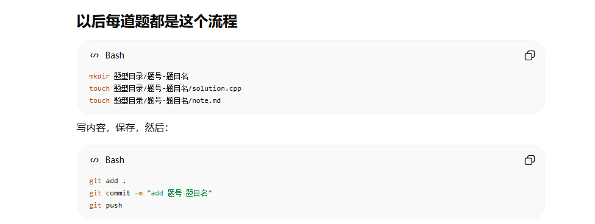

# LeetCode C++ Notes

这个仓库用于记录我的 LeetCode 刷题过程，包括：

- C++ 代码
- 解题思路
- 错误原因
- 复杂度分析
- 题型总结
- 面试复盘

---

## 一、刷题记录

| 题号 | 题目 | 类型 | 难度 | 代码 | 笔记 |
|---|---|---|---|---|---|
| 0001 | Two Sum | 哈希表 | Easy | [solution.cpp](./01-array/0001-two-sum/solution.cpp) | [note.md](./01-array/0001-two-sum/note.md) |

---

## 二、题型分类

| 分类 | 目录 | 说明 |
|---|---|---|
| 数组 | `01-array` | 数组基础、原地修改、遍历 |
| 哈希表 | `02-hash` | 快速查找、去重、计数 |
| 滑动窗口 | `03-sliding-window` | 连续子串、连续子数组 |
| 前缀和 | `04-prefix-sum` | 区间和、子数组和 |
| 双指针 | `05-two-pointers` | 左右指针、快慢指针 |
| 栈与队列 | `06-stack-queue` | 单调栈、队列模拟 |
| 二叉树 | `07-binary-tree` | DFS、BFS、递归 |
| 动态规划 | `08-dynamic-programming` | 状态定义、状态转移 |
| 回溯 | `09-backtracking` | 组合、排列、搜索 |
| 图论 | `10-graph` | BFS、DFS、最短路 |
| 总结 | `99-summary` | 题型规律和错题总结 |

---

## 三、每道题记录内容

每道题单独建立一个文件夹，包含：

```text
题号-题目名/
├── solution.cpp
└── note.md
```
## 四、上传码仓
提交代码方式如下图所示


